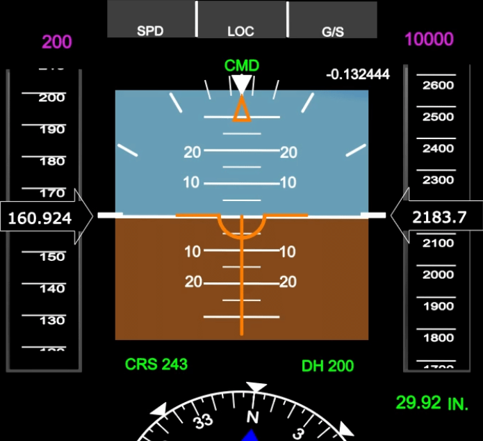

This project was bootstrapped with [Create React App](https://github.com/facebook/create-react-app).

## Available Scripts

In the project directory, once cloned you can run:

### `yarn install`

### `yarn start`

## Expected

The principle is to simulate a "primary flight display" i.e. a visual representation of the on-board instrument present in the aircraft.
This on-board instrument allows you to view certain flight parameters such as altitude, speed, attitude, heading, etc.)

The usual representation (above) includes at least 4 main pieces of information:

- the speed (left column)
- the attitude of the plane (in the center - represented in relation to the horizon line)
- the altitude (right column)
- the direction (at the bottom, represented by a half compass)

This is mainly what interests us here: simulating the movement of flight indicators on a web page. For a little more detail and especially to visualize the animation, here is a video which explains and very clearly shows the required animation: https://www.youtube.com/watch?v=Pq_SPOwYu7A

Regarding the expected, the ideal would be to visualize and animate the speed, altitude and compass (if possible). It is not necessary to represent/animate the attitude of the plane.
The ideal visual representation should not be as complex as the screenshot above, but as minimalistic as possible (see http://www.flightwatching.com/ for a good example).

For data there is a csv file in @src/data.
The columns in order of appearance: Radio Altitude; Angle ; Ground Speed; Magnetic Heading; True Heading; Pitch.

